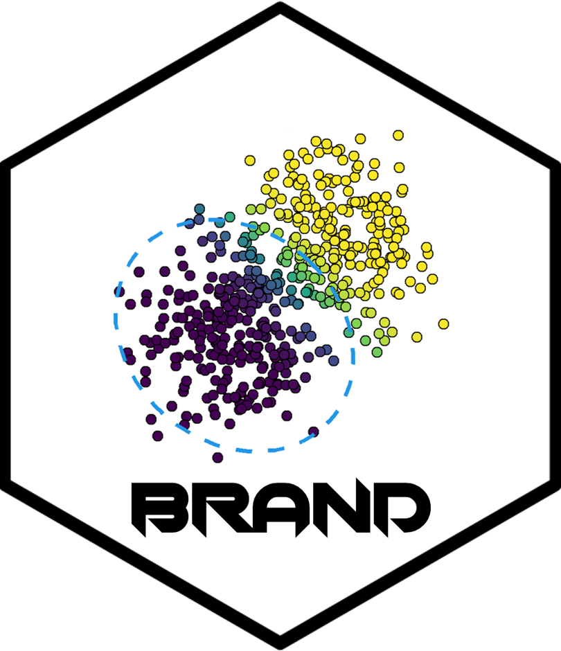

# BRAND - public repository

Public repo for BRAND: Bayesian  Robust  Adaptive  Novelty Detector. 

This repository is associated with the paper Denti, Cappozzo, Greselin (2021) *A two-stage Bayesian semiparametric model for novelty detection with robust prior information.* [https://doi.org/10.1007/s11222-021-10017-7](https://doi.org/10.1007/s11222-021-10017-7)

